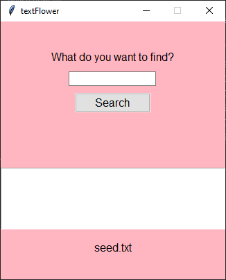

# TextFlower

TextFlower - a program that can choose a letter name for a color in response to a request in the form of a word in Russian or English, hex or rgb code, or a sticker. It is strictly limited so far by the small dictionary of words that lies with it.

## Query examples:

```python
- red
- #ff0000
- rgb(255, 0, 0) - spaces must also be between the numbers, otherwise an error!
- 🔴
- красный
```

## Sample response:

```python
['red', '#ff0000', 'rgb(255, 0, 0)', '🔴', 'красный']
```

---



*Figure 1. Screenshot of the program*